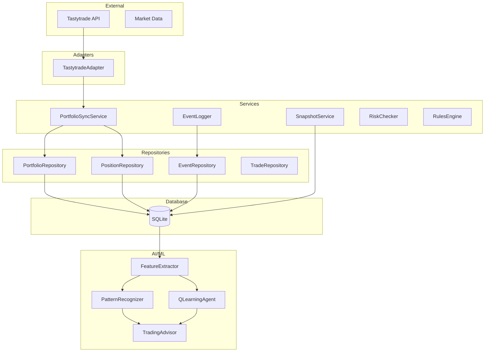
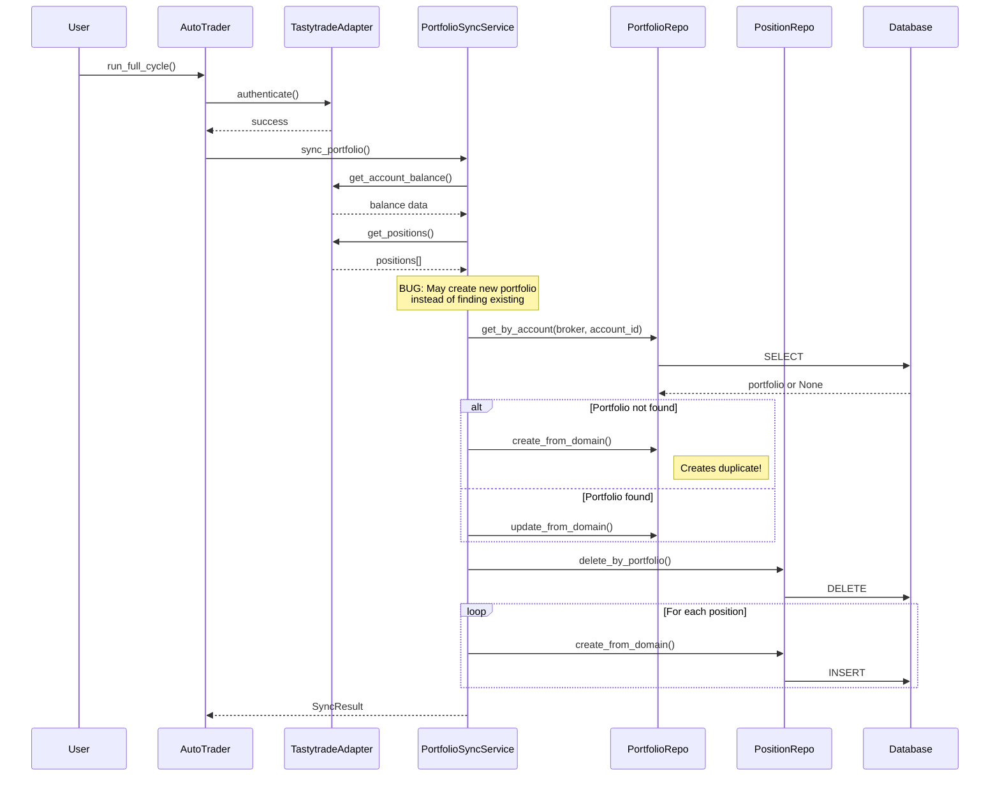
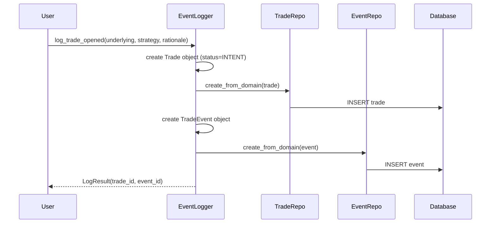
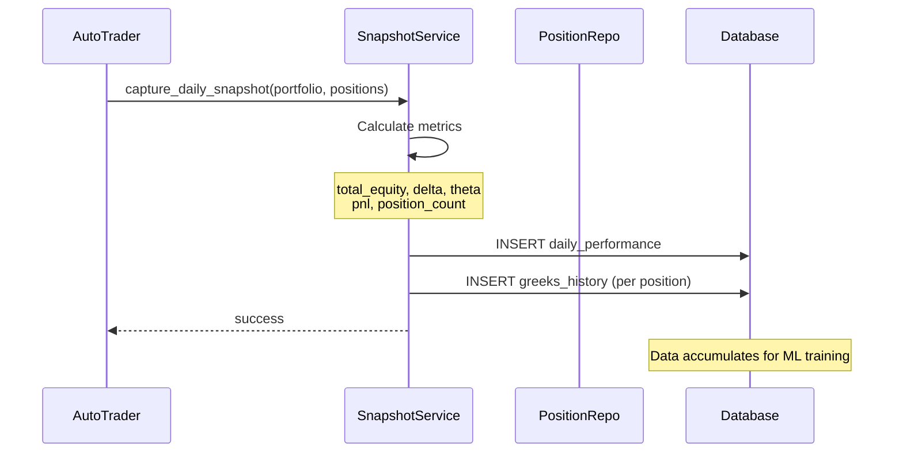
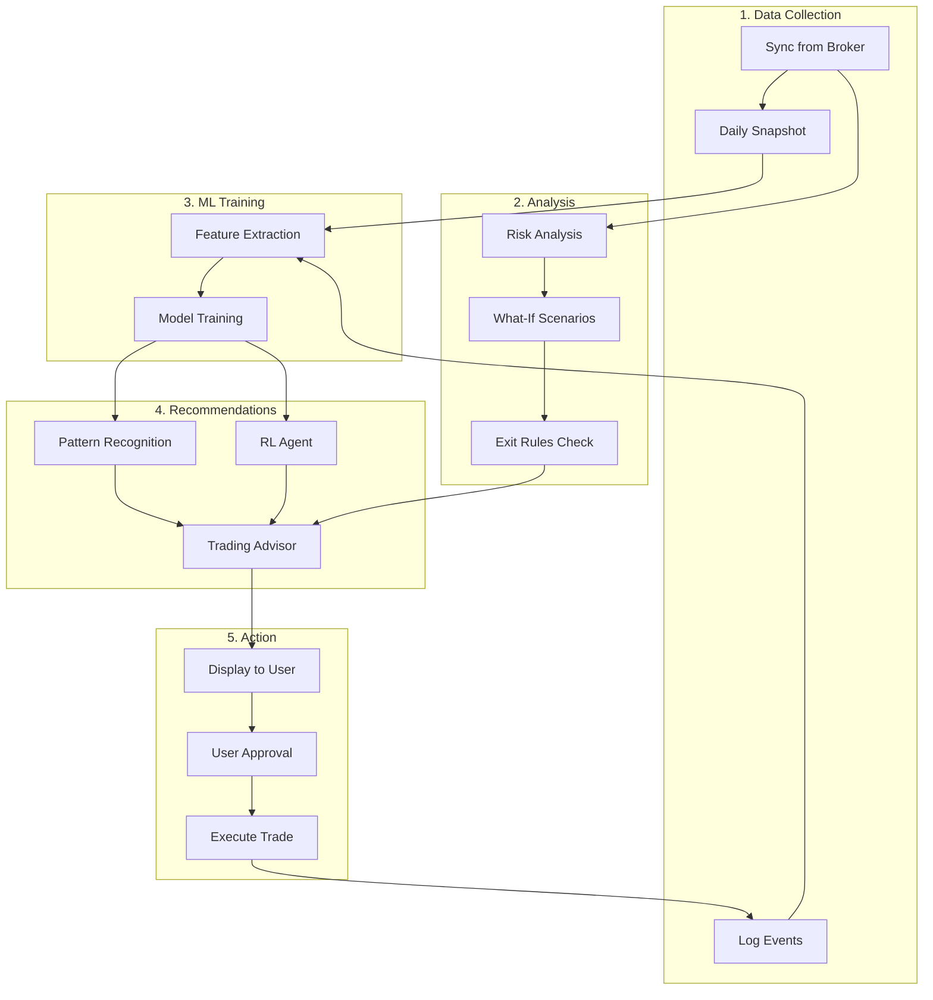
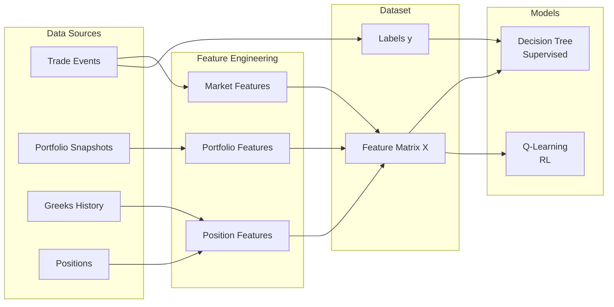
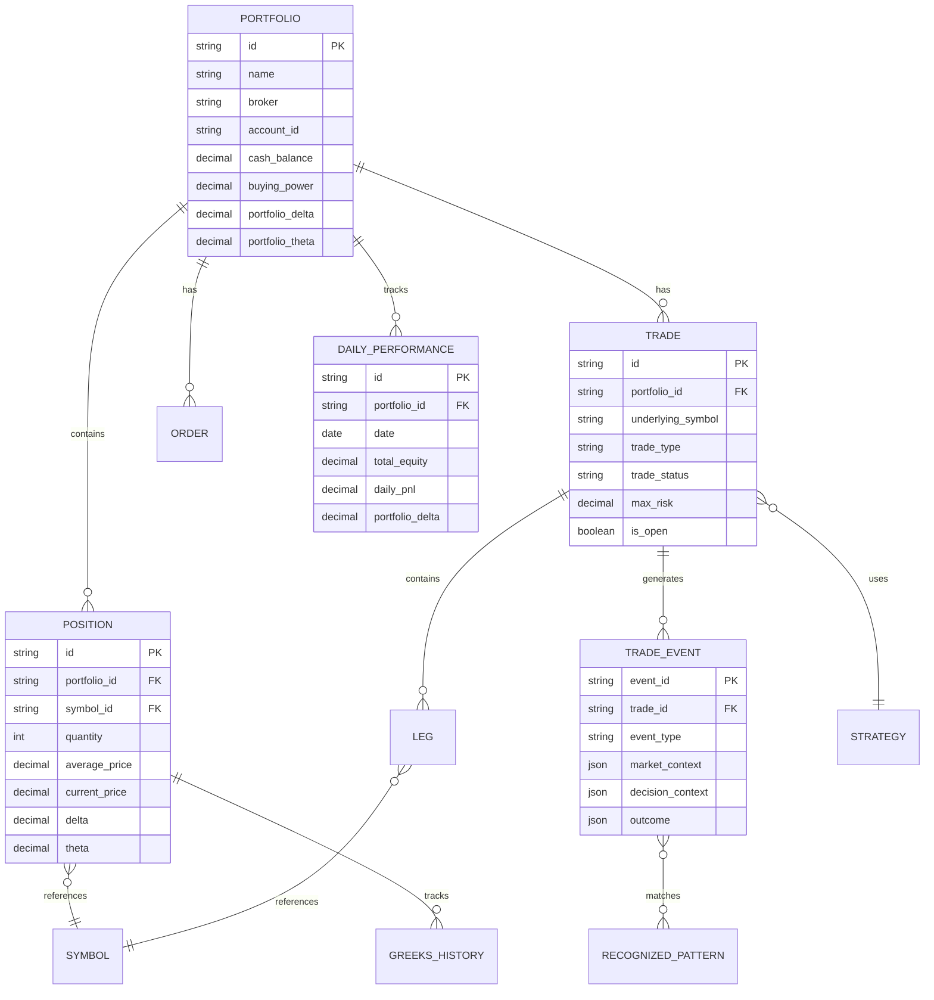
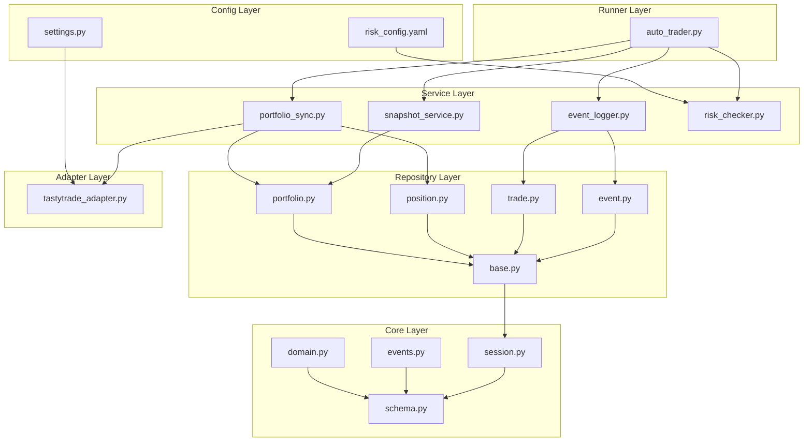

# Trading Co-Trader: Architecture & Flow

> This document contains system architecture, data flows, and component diagrams.
> Uses Mermaid format for diagrams (renders in GitHub).

---

## 1. System Overview



---

## 2. Current Data Flow (What's Working)

### 2.1 Portfolio Sync Flow



### 2.2 Event Logging Flow



### 2.3 Snapshot Flow (For ML)



---

## 3. Future Data Flow (After Integration)

### 3.1 Complete Trading Cycle with AI



### 3.2 ML Data Pipeline



---

## 4. Database Schema Overview



---

## 5. Module Dependencies



---

## 6. Component Status

| Component | Status | Notes |
|-----------|--------|-------|
| TastytradeAdapter | ✅ Working | Auth, positions, balance |
| PortfolioSyncService | ⚠️ Bug | May create duplicate portfolios |
| EventLogger | ✅ Working | Logs trade intents/events |
| SnapshotService | ✅ Working | Daily snapshots for ML |
| RiskChecker | ✅ Working | Basic risk checks |
| PortfolioRiskAnalyzer | 📋 New | VaR, correlation - needs integration |
| RulesEngine | 📋 New | Exit rules - needs integration |
| FeatureExtractor | 📋 New | ML features - needs integration |
| PatternRecognizer | 📋 New | Supervised learning - needs data |
| QLearningAgent | 📋 New | RL agent - needs data |
| TradingAdvisor | 📋 New | Combined advisor - needs integration |

---

## 7. File Organization

```
trading_cotrader/
├── PROJECT_STATUS.yaml      # YOU edit - current state
├── ARCHITECTURE.md          # This file - diagrams/flows
│
├── adapters/                # External integrations
├── analytics/               # Your existing analytics
├── config/                  # Configuration
├── core/                    # Domain models, DB schema
├── repositories/            # Data access
├── services/                # Business logic
├── ai_cotrader/            # ML/RL modules
└── runners/
    └── auto_trader.py       # Main entry point
```

---

*Last updated: 2026-01-24*
