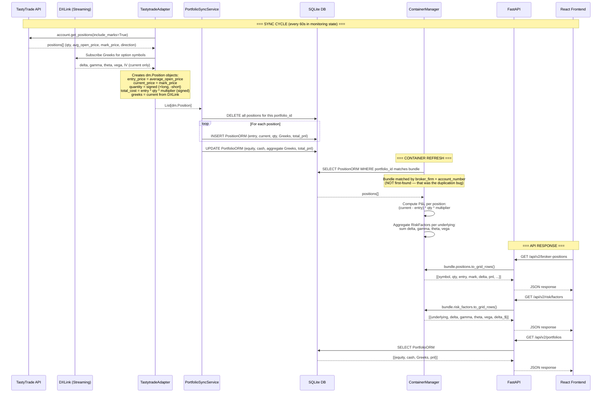
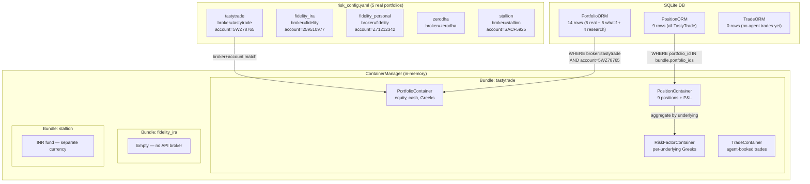
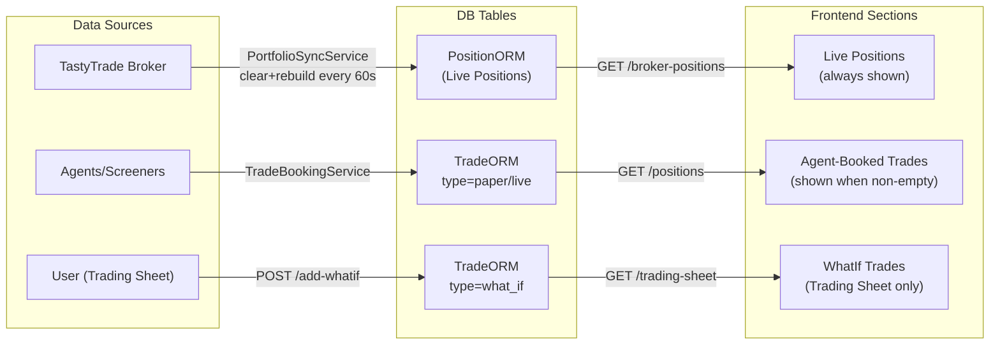
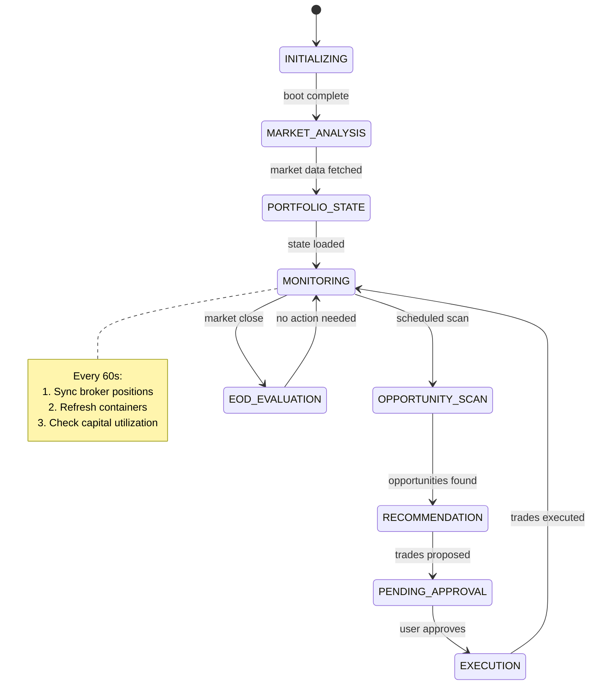

# Trading Co-Trader: Architecture & Data Flow

> Source of truth for system architecture and data flows.
> Uses Mermaid format for diagrams (renders in GitHub/VS Code).
> Last updated: 2026-02-21 (Session 28)

---

## 1. Position Data Flow: Broker to Screen

This is the critical path. Every number you see on screen traces back through this flow.



### What TastyTrade Provides vs What We Compute

| Data Point | Source | Notes |
|-----------|--------|-------|
| Entry price | TT `average_open_price` | Per-contract price at fill |
| Current price | TT `mark_price` | Mid of bid/ask |
| Quantity + direction | TT `quantity_direction` | Long/Short enum |
| Current Greeks | DXLink streaming | Real-time delta/gamma/theta/vega |
| **Entry Greeks** | **NOT AVAILABLE** | TT has no historical Greeks API |
| **P&L** | **We compute** | `(current - entry) * qty * multiplier` |
| **P&L attribution** | **NOT YET** | Needs entry Greeks + daily snapshots |

---

## 2. Container Architecture



### Bundle-to-DB Matching (Fixed Bug)

**Before (broken):** `load_from_repositories()` grabbed the first portfolio from DB for every bundle. All 5 bundles got TastyTrade's portfolio_id → 5x duplication.

**After (fixed):** Each bundle stores `broker_firm` + `account_number` from risk_config.yaml. DB lookup uses `WHERE broker = ? AND account_id = ?`. Only the matching bundle gets positions.

---

## 3. Real Trades vs Agent Trades vs WhatIf



| Concept | DB Table | Created By | Lifecycle | Has Entry Greeks? |
|---------|----------|-----------|-----------|-------------------|
| **Live Positions** | PositionORM | Broker sync | Destroyed + recreated every sync | No |
| **Agent Trades** | TradeORM (paper/live) | Agents/Screeners | Persist until closed | Yes (captured at booking) |
| **WhatIf Trades** | TradeORM (what_if) | User via UI | Persist until booked or deleted | Yes (computed at creation) |

---

## 4. Workflow Engine Lifecycle



### Engine Boot Sequence

```
1. _init_container_manager()     → Create bundles from risk_config.yaml
2. _authenticate_adapters()      → Auth TastyTrade API
3. _sync_broker_positions()      → Fetch positions → DB
4. _refresh_containers()         → Load DB → ContainerManager
5. Start FastAPI web server      → Serve API on :8080
6. Start APScheduler             → Monitor every 60s
```

---

## 5. P&L Calculation

### Formula (Fixed 2026-02-21)

```
unrealized_pnl = (current_price - entry_price) * quantity * multiplier
```

- **Long call** bought at $5, now at $3: `(3 - 5) * 1 * 100 = -$200`
- **Short put** sold at $7.47, now at $5.05: `(5.05 - 7.47) * (-2) * 100 = +$484`
- **Long stock** at $54.50, now at $52.79: `(52.79 - 54.50) * 100 * 1 = -$171`

### Previous Bug (Sessions 25-27)

Old formula: `current_price * qty * multiplier - abs(total_cost)`
- Short positions always showed massive losses because total_cost was unsigned
- Portfolio P&L was **-$6,260.50** when actual was **-$162.50**

---

## 6. Key File Map

| Layer | File | Purpose |
|-------|------|---------|
| **Adapter** | `adapters/tastytrade_adapter.py` | TastyTrade API + DXLink Greeks |
| **Sync** | `services/portfolio_sync.py` | Broker → DB (clear+rebuild) |
| **DB Schema** | `core/database/schema.py` | 21 ORM tables |
| **Domain** | `core/models/domain.py` | Position, Trade, Portfolio, Greeks |
| **Containers** | `containers/container_manager.py` | In-memory bundles, DB loading |
| **Bundle** | `containers/portfolio_bundle.py` | Per-portfolio container group |
| **Position Container** | `containers/position_container.py` | Position state + P&L computation |
| **Risk Factors** | `containers/risk_factor_container.py` | Per-underlying Greeks aggregation |
| **Engine** | `workflow/engine.py` | State machine + sync + refresh |
| **API v2** | `web/api_v2.py` | FastAPI endpoints for frontend |
| **Trading Sheet** | `web/api_trading_sheet.py` | 4 endpoints for trading view |
| **Config** | `config/risk_config.yaml` | 15 portfolios, risk limits |
| **Frontend** | `frontend/src/pages/PortfolioPage.tsx` | Portfolio + Positions + Risk |

---

## 7. Known Gaps

| Gap | Impact | Fix Needed |
|-----|--------|------------|
| No entry Greeks | Can't do P&L attribution (delta/theta/vega breakdown) | Capture Greeks at first sync of new position |
| No daily snapshots | Can't track Greeks evolution over time | PositionGreeksSnapshotORM exists but unpopulated |
| VaR not computed fresh | Shows stale DB value | Wire VaR calculator into sync cycle |
| No position health | Missing % of max profit, breakeven distance | Compute from entry/current/strikes |
| Fidelity/Zerodha no API | Positions only for TastyTrade | Manual entry or adapter stubs |

---

*This document is the single source of truth for data flow. Update it when the flow changes.*
